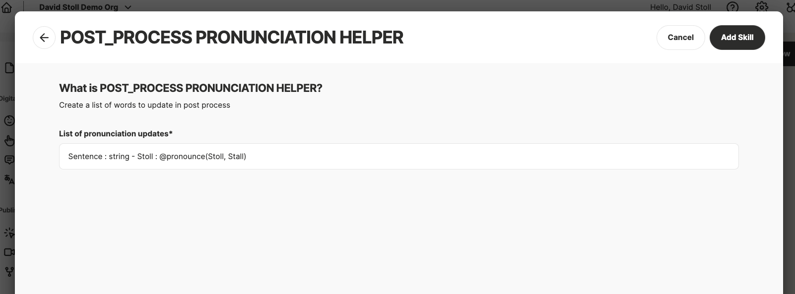

# Pronunciation Skill

[GCP Function: https://us-central1-text-replacement-skill.cloudfunctions.net/smTextReplace](https://console.cloud.google.com/functions/details/us-central1/smTextReplace?env=gen2&project=text-replacement-skill)

## Description

The Pronunciation Skill can be included with any DDNA Studio project as a post-process skill. This skill enables the user to provide a list of words or phrases that require updating without making updates to the base NLP or Gen AI conversation. 

## Sample Skill Definition
```json
{
  "name": "Correct Pronunciation",
  "summary": "Create a list of words to update in post process",
  "description": "You may use the Correct Pronunciation to speak words, phrases, or characters in a specific way while displaying different text in the User Interface to the user. As you begin to test and interact with your Digital Person, you may notice parts of the spoken dialog could benefit from pauses, emphasis etc.",
  "status": "ACTIVE",
  "serviceProvider": "SKILL_API",
  "category": null,
  "endpointInitialize": null,
  "endpointSession": null,
  "endpointExecute": "https://us-central1-text-replacement-skill.cloudfunctions.net/smTextReplace",
  "endpointEndSession": null,
  "endpointEndProject": null,
  "endpointMatchIntent": null,
  "languages": null,
  "config": {
    "skillType": "POST_PROCESS",
    "configMeta": [
      {
        "name": "replacementList",
        "type": "TEXT",
        "label": "List of comma separated updates",
        "required": true
      }
    ]
  }
}
```

The skill definition creates an `replacementList` input that allows you to paste a string of phrases and their pronunciations in the conversation. Phrase/Replacement pairs can be entered into the text area field and are delimited by a new line (`\n`), while the individual words to replace are delimited by a comma and space (`, `).

ex: `Sentence - string\nStoll - @pronounce(Stoll, Stall)`



## Sample Request
```json
{
  "projectId": "ABC123",
  "deploymentEnvironment": "preview",
  "sessionId": "7600aff2-6ebd-44de-bcd2-1facd8ab4f29",
  "intent": {
    "name": "MY_INTENT",
    "confidence": 0
  },
  "text": "This is a sentence to demonstrate the text replacement skill, developed by David Stoll at Soul Machines.",
  "config": {
    "pronounceList": "Sentence, string\nStoll, Stall"
  }
}
```
## Sample Response
```json
{
    "output": {
        "text": "This is a @pronounce(sentence, string) to demonstrate the text replacement skill, developed by David @pronounce(Stoll, Stall) at Soul Machines.",
        "variables": {}
    },
    "endConversation": false,
    "endRouting": false
}
```